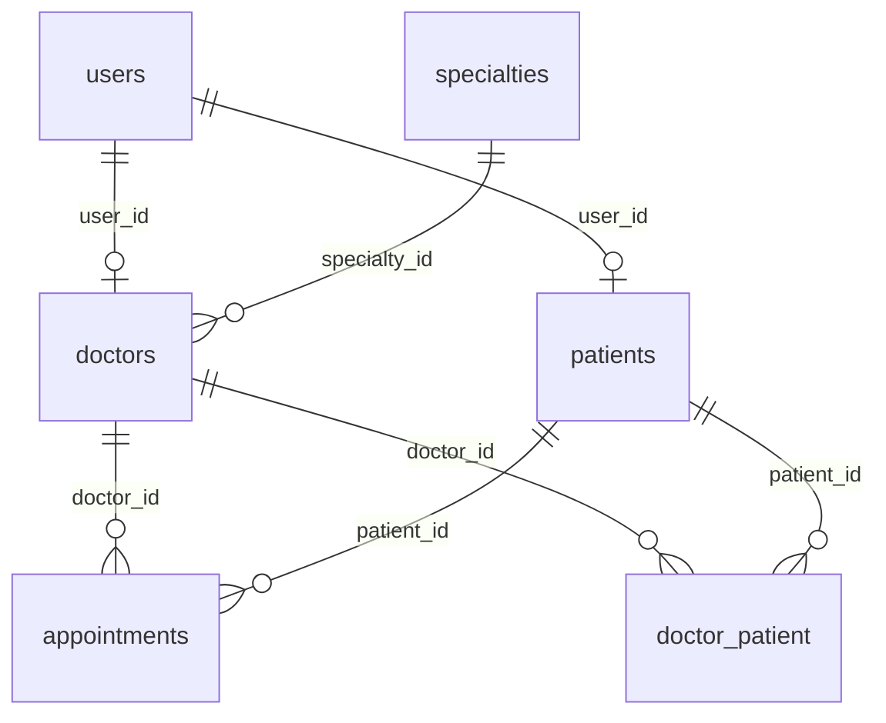

# DESIGN.md — san-benito

Sistema de gestión de turnos para pacientes de un sanatorio. Este documento es la
**única fuente de verdad** del diseño. Quien implemente (persona o agente) debe seguirlo
tal cual está escrito. Si algo no está especificado acá, **no se inventa: se pregunta
al dueño del proyecto antes de implementar**.

## 1. Alcance de la v1

Incluye:

- Registro público de pacientes.
- Búsqueda de doctores por especialidad (obligatoria) y nombre (opcional).
- Carga manual de slots disponibles (doctor para sí mismo; admin para cualquier doctor).
- Plantilla semanal de franjas + generación explícita de slots del mes actual,
  el siguiente o el posterior (Settings → Agenda, modal por mes).
- Reserva de turno por el paciente (atómica, sin doble reserva).
- Cancelación de turnos (paciente el propio, doctor los de su agenda, admin cualquiera).
- Agenda del doctor; vista admin de todos los turnos con filtros.
- Alta de doctores y admins por administradores; gestión de roles por super admin.
- Relación doctor–paciente (pivote); sección **Mis pacientes** del doctor; alta
  manual del vínculo (doctor / admin).

**Fuera de alcance v1** (no implementar nada de esto):

- Mails o notificaciones de cualquier tipo.
- Estado "turno atendido/completed".
- Historial de cancelaciones / auditoría.
- Recurrencia viva / jobs / generación más allá del mes actual, el siguiente y el posterior.
- Recordatorios, multi-sede, multi-tenant, API pública, historia clínica.
- Borrado / desvinculación de la relación doctor–paciente.
- Metadatos extra en el vínculo (obra social del vínculo, notas, etc.).

## 2. Registro de decisiones

Decisiones ya tomadas por el dueño del proyecto. No reabrirlas.

- **D1 — Single-tenant**: una sola institución. Sin teams ni scoping por tenant.
- **D2 — Patrón de datos: Services + Eloquent directo.** No hay capa Repository.
  Reglas duras: (a) los controllers **nunca** hacen queries ni contienen lógica — solo
  reciben el request validado, llaman a un service y devuelven una respuesta Inertia;
  (b) toda query reutilizable se encapsula como **scope de Eloquent** en el modelo.
- **D3 — Disponibilidad materializada**: los turnos existen como filas concretas en
  `appointments`. Se cargan a mano (día a día / franja del día) o se materializan
  desde una plantilla semanal para el mes actual, el siguiente o el posterior
  (d23). No hay recurrencia viva ni generación automática continua.
- **D4 — Especialidades catalogadas**: tabla `specialties`, FK desde `doctors`. No es
  texto libre.
- **D5 — Cancelación**: pueden cancelar el paciente (sus turnos), el doctor (turnos de
  su agenda) y admin/super admin (cualquiera). **Sin límite horario**: se puede cancelar
  hasta el horario de inicio del turno.
- **D6 — Al cancelar, el slot se reabre**: vuelve a `status = available` con
  `patient_id = null`. Consecuencia: no queda registro del turno cancelado (aceptado,
  ver "fuera de alcance": sin historial en v1). Por esto el enum de status tiene solo
  dos valores: `available` y `booked`.
- **D7 — Sin estado `completed`** en v1.
- **D8 — Sin mails** en v1. El contenedor `queue` existe por paridad de stack pero no
  hay jobs; no crear Mailables ni Notifications.
- **D9 — Idioma**: código, tablas, rutas y nombres de archivo en **inglés**; todos los
  textos visibles de UI en **español**.
- **D10 — Roles y entidades separados**: los roles de Spatie autorizan; las entidades
  `Doctor`/`Patient` guardan datos de dominio. Los services los mantienen consistentes
  (crear entidad ⇒ asignar rol). Nunca chequear "es doctor" mirando si existe la
  entidad; siempre por rol.
- **D21 — Relación doctor–paciente explícita**: tabla pivote `doctor_patient`
  (`unique(doctor_id, patient_id)`), independiente de `appointments`. Nace al
  **reservar** un turno (idempotente: `firstOrCreate`) **y** por **alta manual**
  (doctor / admin). **No se borra en v1** (cancelar un turno no toca la pivote).
  UI: sección **Mis pacientes** del doctor. Sin metadatos extra en v1 (solo el par
  + timestamps); se agregarán después si hace falta.

Decisiones menores tomadas por el diseñador (vetables por el dueño, avisar si se cambian):

- **d11 — Validación de slots**: al crear un slot, el service valida `starts_at` en el
  futuro, `ends_at > starts_at`, y que **no se solape** con otro slot del mismo doctor.
  Además, constraint de base `unique(doctor_id, starts_at)`.
- **d12 — Borrado de slots**: un slot `available` se elimina con hard delete. Un slot
  `booked` no se puede eliminar (primero se cancela, lo que lo reabre).
- **d13 — Registro de paciente**: campos requeridos `name`, `email`, `password`,
  `dni`, `birth_date`; opcionales `phone`, `health_insurance`.
- **d14 — Redirección post-login**: `patient` → `/doctors`; `doctor` → `/agenda`;
  `admin` y `super_admin` → `/admin/appointments`.
- **d15 — Vista calendario**: las pantallas **Mi agenda** (doctor), **Mis turnos**
  (paciente) y **turnos disponibles de un doctor** muestran un calendario mensual
  compacto a la izquierda y el detalle del día seleccionado en el **panel derecho**
  (sin modal). Si no hay día elegido, el panel muestra una pista corta.
- **d16 — Alta de slots (doctor)**: en **Mi agenda**, el alta ocurre **en el panel
  del día** (junto al calendario). Dos modos: **classic** (solo hora de inicio;
  `ends_at` lo calcula el **servidor** como `starts_at + doctor.slot_duration_minutes`)
  y **range** (hora inicio + hora fin de franja; el servidor divide la franja en
  slots de esa duración; si sobra tiempo incompleto, se descarta). El cliente solo
  previsualiza. Admin puede seguir enviando `starts_at`/`ends_at` explícitos.
- **d17 — Zona horaria**: `APP_TIMEZONE=America/Argentina/Buenos_Aires`. Los
  `starts_at`/`ends_at` son **hora de pared** de la institución. La API los
  serializa sin sufijo `Z`; el frontend los formatea sin convertir a UTC del
  navegador.
- **d18 — Búsqueda de doctores**: en `/doctors` se puede filtrar por **especialidad**
  y/o buscar por **nombre** (libre, sin exigir especialidad). Sin ningún filtro la
  lista queda vacía hasta que el usuario elija especialidad o escriba un nombre.
- **d19 — Turnos próximos**: en **Mis turnos** (paciente) y en **turnos disponibles
  de un doctor**, arriba del detalle del día, se listan los **5 turnos futuros más
  cercanos** bajo el título “Turnos próximos”. Tocá uno para seleccionar ese día
  en el calendario/panel.
- **d20 — Duración de turno por doctor**: cada doctor tiene `slot_duration_minutes`
  (default **20**, rango válido **5–120**). Se configura en **Settings → Agenda**
  (`GET/PATCH /settings/agenda`, solo rol `doctor`). Cambiar la duración no muta
  slots ya creados. Alta por franja (día a día): transacción all-or-nothing (si
  algún slot solapa o es inválido, no se crea ninguno).
- **d21 — Alta manual del vínculo**: el doctor solo vincula pacientes **a sí mismo**;
  admin/super_admin puede vincular **cualquier paciente a cualquier doctor**. La
  selección del paciente es por búsqueda (DNI y/o nombre) entre pacientes ya
  registrados. Si el par ya existe, la operación es idempotente (sin error).
- **d22 — Mis pacientes (UI)**: lista del doctor con nombre, DNI y contacto
  (`phone` / `email` del `User`). Sin “próximo turno” en v1 (se puede derivar
  después de `appointments`). Admin no tiene listado global de vínculos en v1:
  solo el endpoint de alta (el doctor ve los suyos en **Mis pacientes**).
- **d23 — Plantilla semanal + generación mensual**: cada doctor tiene
  `weekly_availability` (JSON nullable): lista plana de
  `{ weekday: 1–7 (ISO lun–dom), start: "H:i", end: "H:i" }`. En Settings →
  Agenda, la UI muestra **Crear turnos para:** con botones del mes actual, el
  siguiente y el posterior; al elegir uno se abre un modal “Franjas semanales
  para el mes” donde se configuran las franjas. `POST /settings/agenda/generate`
  con `target=current|next|after_next` y `weekly_availability` guarda la
  plantilla y materializa slots `available` del mes pedido, cortando cada
  franja con `slot_duration_minutes` (remanente incompleto descartado). Solo
  `starts_at` futuros; solapes se omiten (no all-or-nothing); no se tocan
  `booked`; no se borran `available` huérfanos. Flash con resumen
  creados/omitidos. Solo rol `doctor` (propia).

## 3. Stack

| Capa | Tecnología |
|---|---|
| Backend | Laravel 12 (PHP 8.2+) |
| Base del proyecto | Starter kit oficial **React** de Laravel 12 (Inertia + React + TypeScript + Tailwind ya cableados; auth con Fortify). Las versiones exactas de React/Tailwind/Inertia son las que fije el starter kit — no bajarlas ni cambiarlas. |
| Roles/permisos | `spatie/laravel-permission` |
| Base de datos | MySQL 8.0 (tests contra base `testing`) |
| Package manager JS | `yarn` — prohibido `npm` (un solo lockfile: `yarn.lock`) |
| Calidad | PHPUnit, Laravel Pint, ESLint + Prettier |
| Entorno local | Laravel Sail (Docker). Nada corre fuera del contenedor. |

## 4. Contenedores (Sail)

`docker-compose.yml` con exactamente estos servicios:

- **`laravel.test`** — app PHP (runtime Sail), expone `APP_PORT` (80) y `VITE_PORT` (5173).
- **`mysql`** — MySQL 8.0, volumen persistente, script de Sail
  `create-testing-database.sh` que crea la base `testing` para PHPUnit.
- **`queue`** — worker `php artisan queue:work` (sin jobs en v1, ver D8).
- **`mailpit`** — SMTP local, dashboard en `http://localhost:8025` (sin uso en v1).

Comandos siempre vía Sail:

```bash
./vendor/bin/sail up -d
./vendor/bin/sail artisan migrate --seed
./vendor/bin/sail yarn dev
./vendor/bin/sail artisan test
composer pint
```

## 5. Modelo de datos



Migraciones (además de las que trae el starter kit y las de spatie/laravel-permission):

### `specialties`

| Columna | Tipo | Reglas |
|---|---|---|
| `id` | bigint PK | |
| `name` | string | unique |
| timestamps | | |

### `doctors`

| Columna | Tipo | Reglas |
|---|---|---|
| `id` | bigint PK | |
| `user_id` | FK `users.id` | **unique**, cascade on delete |
| `specialty_id` | FK `specialties.id` | not null, restrict on delete |
| `license_number` | string | unique |
| `slot_duration_minutes` | unsigned smallint | not null, default **20** (d20) |
| `weekly_availability` | json | nullable (d23); lista de franjas semanales |
| timestamps | | |

### `patients`

| Columna | Tipo | Reglas |
|---|---|---|
| `id` | bigint PK | |
| `user_id` | FK `users.id` | **unique**, cascade on delete |
| `dni` | string | unique |
| `birth_date` | date | not null |
| `health_insurance` | string | nullable |
| timestamps | | |

### `appointments`

Una sola tabla para slots disponibles y turnos reservados.

| Columna | Tipo | Reglas |
|---|---|---|
| `id` | bigint PK | |
| `doctor_id` | FK `doctors.id` | not null, cascade on delete |
| `patient_id` | FK `patients.id` | **nullable**, null on delete |
| `starts_at` | datetime | not null |
| `ends_at` | datetime | not null |
| `status` | enum `available`, `booked` | default `available` |
| timestamps | | |

Constraints e índices: `unique(doctor_id, starts_at)`; índice en `(status, starts_at)`;
índice en `patient_id`.

Invariante: `status = booked` ⇔ `patient_id` no es null.

### `doctor_patient`

Pivote many-to-many doctor ↔ paciente (D21). Independiente de `appointments`.

| Columna | Tipo | Reglas |
|---|---|---|
| `id` | bigint PK | |
| `doctor_id` | FK `doctors.id` | not null, cascade on delete |
| `patient_id` | FK `patients.id` | not null, cascade on delete |
| timestamps | | |

Constraint: `unique(doctor_id, patient_id)`.

### `users`

La del starter kit + columna `phone` (string, nullable). Los datos de dominio **no**
van en users (ver D10).

### Modelos y relaciones

- `User`: `hasOne(Doctor)`, `hasOne(Patient)`, trait `HasRoles` de Spatie.
- `Doctor`: `belongsTo(User)`, `belongsTo(Specialty)`, `hasMany(Appointment)`,
  `belongsToMany(Patient)` vía `doctor_patient`.
- `Patient`: `belongsTo(User)`, `hasMany(Appointment)`,
  `belongsToMany(Doctor)` vía `doctor_patient`.
- `Specialty`: `hasMany(Doctor)`.
- `Appointment`: `belongsTo(Doctor)`, `belongsTo(Patient)`.
  Scopes obligatorios: `available()` (status available y `starts_at` futuro),
  `booked()`, `forDoctor($doctorId)`, `forPatient($patientId)`, `upcoming()`.

No hace falta modelo Eloquent propio para la pivote en v1 (alcanza `belongsToMany`
con `withTimestamps()`). Todos los modelos de dominio con factory.
`AppointmentFactory` con estados `available()` y `booked()`.

## 6. Roles y permisos

Roles Spatie (seeder): `patient`, `doctor`, `admin`, `super_admin`.

| Acción | Paciente | Doctor | Admin | Super admin |
|---|---|---|---|---|
| Registrarse solo (registro público) | Sí | No | No | No |
| Buscar doctores por especialidad (+ nombre opcional) | Sí | Sí | Sí | Sí |
| Ver slots disponibles de un doctor | Sí | Propios | Sí | Sí |
| Reservar turno | Sí | No | No | No |
| Cancelar turno | Propios | De su agenda | Cualquiera | Cualquiera |
| Crear/eliminar slots | No | Propios | Cualquier doctor | Cualquier doctor |
| Configurar duración / plantilla semanal; generar mes | No | Sí (propia) | No | No |
| Ver mis pacientes / vincular paciente (manual) | No | Propios | Cualquier doctor | Cualquier doctor |
| Ver todos los turnos | No | No | Sí | Sí |
| Alta de doctores y admins | No | No | Sí | Sí |
| Gestión de usuarios y roles | No | No | No | Sí |

Implementación: middleware `role:` de Spatie a nivel de grupo de rutas +
`AppointmentPolicy` para acciones sobre turnos concretos (`book`, `cancel`, `delete`).

## 7. Reglas de negocio

- **Reserva atómica**: reservar ejecuta un único
  `UPDATE appointments SET patient_id = ?, status = 'booked' WHERE id = ? AND status = 'available'`
  y verifica filas afectadas. Si afectó 0 filas, el turno ya no estaba disponible →
  error de dominio con mensaje en español ("El turno ya no está disponible").
  Prohibido el patrón leer-luego-guardar para la reserva. En la **misma transacción**,
  tras un book exitoso, `firstOrCreate` del par en `doctor_patient` (D21).
- **Cancelación**: setea `patient_id = null` y `status = 'available'` (D6). Autoriza
  la policy según D5. Solo turnos futuros (`starts_at > now()`). **No** elimina ni
  modifica filas de `doctor_patient`.
- **Vínculo doctor–paciente (alta manual)**: `firstOrCreate` del par; idempotente si
  ya existe (d21). El doctor solo puede crear vínculos con `doctor_id` = el suyo;
  admin/super_admin indica el doctor. El paciente debe existir (rol/entidad patient).
- **Reserva solo de slots futuros**: el scope `available()` excluye slots pasados.
- **Creación de slots**: validaciones de d11. Los admins indican el doctor; los
  doctores solo crean para sí mismos (modos classic/range, d16/d20). Franja del
  día: solo slots completos; remanente descartado; all-or-nothing.
- **Generación mensual desde plantilla** (d23): el doctor elige mes (actual /
  siguiente / posterior), configura franjas en modal y `POST generate` guarda
  `weekly_availability` + materializa slots. Solo futuros; solapes se omiten;
  no sync-delete de `available` huérfanos; no muta `booked`.
- **Alta de doctor** (por admin): crea `User` + `Doctor` + asigna rol `doctor` en una
  transacción, dentro de `DoctorService`. Ídem alta de admin (solo user + rol).
- **Registro de paciente**: crea `User` + `Patient` + asigna rol `patient` en una
  transacción, dentro de `PatientService`.

## 8. Rutas

Todas con middleware `auth` salvo registro/login (los provee el starter kit). Prefijos
de rol con middleware `role:`.

### Paciente (`role:patient`)

| Método | Ruta | Controller | Página Inertia |
|---|---|---|---|
| GET | `/doctors` | `DoctorSearchController@index` (query `?specialty_id=` y/o `?name=`) | `Doctors/Index` |
| GET | `/doctors/{doctor}/slots` | `DoctorSlotsController@index` | `Doctors/Slots` |
| POST | `/appointments/{appointment}/book` | `AppointmentBookingController@store` | — (redirect) |
| GET | `/my-appointments` | `MyAppointmentsController@index` | `Appointments/MyAppointments` |
| POST | `/appointments/{appointment}/cancel` | `AppointmentCancellationController@store` | — (redirect) |

### Doctor (`role:doctor`)

| Método | Ruta | Controller | Página Inertia |
|---|---|---|---|
| GET | `/agenda` | `AgendaController@index` | `Doctor/Agenda` |
| POST | `/agenda/slots` | `AgendaSlotController@store` | — (redirect) |
| DELETE | `/agenda/slots/{appointment}` | `AgendaSlotController@destroy` | — (redirect) |
| GET/PATCH | `/settings/agenda` | `Settings\DoctorAgendaSettingsController@edit/update` | `settings/agenda` |
| POST | `/settings/agenda/generate` | `Settings\DoctorAgendaSettingsController@generate` (`target=current\|next\|after_next` + `weekly_availability`) | — (redirect) |
| GET | `/my-patients` | `MyPatientsController@index` (query `?q=` DNI/nombre) | `Doctor/MyPatients` |
| POST | `/my-patients` | `MyPatientsController@store` (`patient_id`) | — (redirect) |

`/appointments/{appointment}/cancel` también acepta doctores (lo resuelve la policy).

### Admin (`role:admin|super_admin`)

| Método | Ruta | Controller | Página Inertia |
|---|---|---|---|
| GET | `/admin/appointments` (filtros `doctor_id`, `patient_id`, `date`) | `Admin\AppointmentController@index` | `Admin/Appointments` |
| GET/POST | `/admin/doctors` | `Admin\DoctorController@index/store` | `Admin/Doctors` |
| POST | `/admin/doctors/{doctor}/slots` | `Admin\DoctorSlotController@store` | — (redirect) |
| POST | `/admin/doctors/{doctor}/patients` | `Admin\DoctorPatientController@store` (`patient_id`) | — (redirect) |
| GET/POST | `/admin/users` (solo `role:super_admin`) | `Admin\UserController@index/store` | `Admin/Users` |

## 9. Estructura de archivos (backend)

```
app/
  Http/
    Controllers/         # finos, sin queries ni lógica (D2)
    Requests/            # un FormRequest por endpoint de escritura
  Models/                # User, Doctor, Patient, Specialty, Appointment
  Policies/AppointmentPolicy.php
  Services/
    AppointmentService.php   # createSlot, createSlotsFromRange,
                             # generateMonthFromWeeklyTemplate, book, cancel, deleteSlot
                             # (book también materializa doctor_patient)
    DoctorPatientService.php # link, listForDoctor (búsqueda q)
    DoctorService.php        # createDoctor, updateAgendaSettings, searchByName
    PatientService.php       # register
database/
  factories/  migrations/  seeders/
```

Seeders: `RoleSeeder` (roles y permisos), `SpecialtySeeder` (catálogo inicial:
Clínica Médica, Pediatría, Cardiología, Dermatología, Traumatología, Ginecología),
`DemoSeeder` solo para desarrollo (1 super admin, 1 admin, 3 doctores con slots
futuros, 2 pacientes; password de todos: `password`). El DemoSeeder puede dejar
algunos vínculos `doctor_patient` de ejemplo.

## 10. Frontend

- Páginas Inertia en `resources/js/Pages/` según la tabla de rutas (§8).
- Layout único con navegación condicionada por rol (los roles del user se comparten
  vía Inertia shared props en `HandleInertiaRequests`). Incluir enlace **Mis pacientes**
  para rol `doctor`.
- Formularios con los componentes que trae el starter kit. Textos en español (D9).
- Redirección post-login según d14.

## 11. Tests mínimos requeridos

Feature tests (PHPUnit, `RefreshDatabase`, contra MySQL `testing`):

1. Registro público crea user + patient + rol `patient`.
2. Paciente filtra por especialidad y/o busca por nombre (coincidencia parcial;
   no ve users que no son doctores). Sin filtros la lista de doctores queda vacía.
3. Paciente ve solo slots `available` futuros de un doctor.
4. Reserva exitosa: status pasa a `booked`, `patient_id` seteado; además existe
   fila en `doctor_patient` para ese par.
5. Doble reserva: dos pacientes sobre el mismo slot — el segundo recibe error y el
   turno queda con el primero.
6. Paciente no puede reservar slots pasados ni turnos ya `booked`.
7. Cancelación por paciente (propio), doctor (su agenda) y admin (cualquiera): el slot
   vuelve a `available` con `patient_id = null`; la fila `doctor_patient` **persiste**.
8. Paciente no puede cancelar turnos ajenos (403).
9. Doctor ve solo su agenda; no puede crear slots para otro doctor.
10. Slots: no se pueden crear en el pasado, con `ends_at <= starts_at`, ni solapados
    con otro slot del mismo doctor.
11. Slot `booked` no se puede eliminar; slot `available` sí.
12. Admin ve todos los turnos y filtra por doctor/paciente/fecha.
13. Rutas de admin devuelven 403 para paciente y doctor; `/admin/users` devuelve 403
    para admin (solo super admin).
14. Alta de doctor por admin crea user + doctor + rol en transacción.
15. Alta manual de vínculo: doctor vincula paciente a sí mismo; no puede vincular a
    otro doctor (403). Admin vincula paciente a cualquier doctor. Par duplicado es
    idempotente.
16. Doctor ve solo sus pacientes en `/my-patients`; búsqueda por DNI/nombre filtra.
17. Doctor guarda `weekly_availability` válida; plantilla inválida (solape mismo
    día, `end <= start`, weekday fuera de rango) falla validación.
18. Generate `current`/`next`/`after_next` con franjas en el request materializa
    slots; guarda plantilla; omite pasados y solapes; no muta `booked`;
    reaplicar no duplica.

## 12. Calidad y convenciones

- Ramas `feature/<slug>` desde `main`; todo entra por PR; nunca commit directo a `main`.
- Conventional Commits (`feat: …`, `fix: …`, `chore: …`).
- Gate de backend: `./vendor/bin/sail artisan test` en verde + `composer pint`.
- Gate de frontend: `yarn build` (tsc + Vite) + `yarn lint` cuando se toca TS/React.
- Verificación visual (desktop 1440×900 y mobile 390×844) antes de cerrar cambios de UI.
- `.editorconfig`: 4 espacios, LF, newline final.

## 13. Protocolo ante ambigüedad

Si durante la implementación aparece una decisión no cubierta por este documento
(un campo nuevo, una regla de negocio, un cambio de flujo), **no improvisar**:
detenerse, plantear la pregunta con opciones y trade-offs al dueño del proyecto, y
recién implementar cuando haya respuesta. Registrar la decisión nueva en §2.

## 14. Sistema visual (UI)

Fuente de verdad visual: [`design.md`](design.md) + tokens en `tokens.css`
(importados desde `resources/css/app.css`). No inventar colores ni tipografías
fuera de esos tokens. Resumen: modern-minimal · blanco / dark · botones azul
filled en ambos modos · Inter Tight + IBM Plex Sans.
