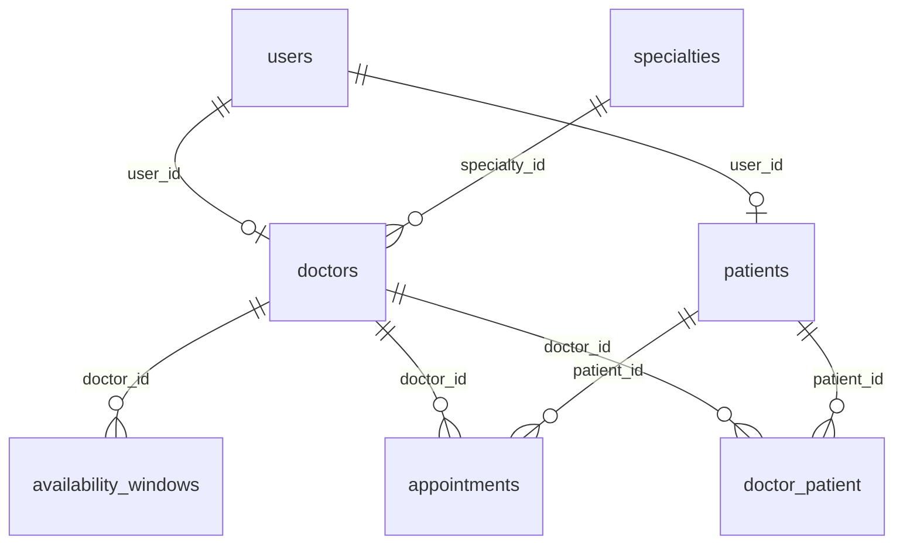

# new-design.md — san-benito (constitución de producto v1)

Constitución de producto v1.

Este archivo es la **única fuente de verdad de producto**. `DESIGN.md` (slots `available` pre-creados) se retiró: contradecía el modelo de franjas. Quien implemente debe seguir **este** documento. Si algo no está acá, **no se inventa: se pregunta** (§12). Visual: [`design.md`](design.md).

El producto usa **Fortify** (`routes/auth.php`): email + contraseña. No hay atajo de login por rol sin password.

**Modelo de disponibilidad (dueño, 2026-09-09):** no hay fila de “turno disponible”. El doctor (o el admin, para cualquier doctor) persiste **franjas de trabajo**. Los huecos de 20 min (u otra duración) se **calculan** al leer. Recién al reservar o asignar se inserta `appointments`.

---

## 1. Alcance de la v1

Incluye:

- Autenticación: login Fortify (email + password) y **registro público de paciente** (d13).
- Tras auth, **home de portal** del rol: paciente o doctor (`#page-home`). Admin / super_admin no tienen portal en la demo: entran por las mismas credenciales Fortify y caen en las pantallas admin **heredadas**.
- Portales paciente y doctor con la IA, chrome y flujos de la demo Pruebas (secciones 7–9).
- Capacidades admin / super_admin (la demo admin es **stub**: no hay UI admin que copiar): listar/filtrar reservas, alta de doctores y admins, gestión de roles (`super_admin`), cargar **franjas** para cualquier doctor.
- Relación doctor–paciente (pivote); **Mis pacientes**; alta manual del vínculo; **asignar** paciente vinculado a un hueco **calculado** (aún no persistido).

**Fuera de alcance v1** (no implementar nada de esto):

- Sitio institucional, landing de marketing, `welcome.tsx` como home de invitado.
- Selector de pieles / temas de la demo (cinco diseños). El producto usa `design.md` + chrome Pruebas (§9).
- Mails o notificaciones de cualquier tipo.
- Estado `completed` / “turno atendido”.
- Historial de cancelaciones / auditoría (cancelar **borra** la reserva; no queda fila).
- Agenda recurrente, rrule, jobs. `createSlotsFromRange` (una ventana → muchas filas `available`) **no es** este producto.
- Pre-materializar huecos como `appointments` con `status = available`.
- Recordatorios, multi-sede, multi-tenant, API pública, historia clínica.
- Borrado / desvinculación de `doctor_patient`.
- Metadatos extra en el vínculo (obra social del vínculo, notas, etc.).
- UI admin inventada a partir del stub.
- Atajo de login “entrar como admin” / botones de rol sin password.

**Guest `/`:** login (o redirect a login). No hay landing de producto.

---

## 2. Registro de decisiones

Decisiones ya tomadas. **No reabrir** D1, D2, D8, D9, D10.

- **D1 — Single-tenant**: una sola institución. Sin teams ni scoping por tenant.
- **D2 — Patrón de datos: Services + Eloquent directo.** No hay capa Repository.
  Reglas duras: (a) los controllers **nunca** hacen queries ni contienen lógica — solo
  reciben el request validado, llaman a un service y devuelven una respuesta Inertia;
  (b) toda query reutilizable se encapsula como **scope de Eloquent** en el modelo.
- **D3 — Disponibilidad manual por franjas**: el doctor carga a mano **bloques de trabajo** (fechas concretas × rangos horario). No hay agenda recurrente ni rrule. **No** se insertan turnos vacíos.
- **D4 — Especialidades catalogadas**: tabla `specialties`, FK desde `doctors`. No es texto libre.
- **D5 — Cancelación**: pueden cancelar el paciente (sus turnos), el doctor (turnos de su agenda) y admin/super admin (cualquiera). **Sin límite horario**: se puede cancelar hasta el horario de inicio del turno.
- **D6 — Al cancelar se borra la reserva**: hard delete de la fila en `appointments`. La **franja sigue**; ese horario vuelve a ofrecerse al calcular huecos. Sin historial de **cancelaciones** en v1 (aceptado). Las reservas cuyo horario ya pasó siguen en `appointments` y se listan en **Historial de turnos** (d33). **Reemplaza** el D6 de `DESIGN.md` (reabrir `status = available`).
- **D7 — Sin estado `completed`** en v1. `appointments` **solo** guarda reservas: no hay enum `available` / `booked`.
- **D8 — Sin mails** en v1. El contenedor `queue` existe por paridad de stack pero no hay jobs; no crear Mailables ni Notifications.
- **D9 — Idioma**: código, tablas, rutas y nombres de archivo en **inglés**; todos los textos visibles de UI en **español**.
- **D10 — Roles y entidades separados**: los roles de Spatie autorizan; las entidades `Doctor`/`Patient` guardan datos de dominio. Los services los mantienen consistentes (crear entidad ⇒ asignar rol). Nunca chequear "es doctor" mirando si existe la entidad; siempre por rol.
- **D21 — Relación doctor–paciente explícita**: tabla pivote `doctor_patient` (`unique(doctor_id, patient_id)`), independiente de `appointments`. Nace al **reservar** (paciente), al **asignar** (doctor) y por **alta manual** (doctor / admin). Idempotente: `firstOrCreate`. **No se borra en v1** (cancelar un turno no toca la pivote ni las franjas).
- **D31 — Huecos calculados, reserva persistida**: la UI puede mostrar “14:00 — 14:20” como turno. Eso es `franja ÷ slot_duration_minutes` menos reservas. Persistencia: `availability_windows` al programar; `appointments` **solo** al book/assign.

Decisiones menores (vetables por el dueño):

- **d11 — Validación**: una **franja** exige `ends_at > starts_at`, no solapar otra franja del mismo doctor, y ser lo bastante larga como para al menos un hueco (`>= slot_duration_minutes`). Una **reserva** exige futuro, `ends_at = starts_at + slot_duration_minutes`, alineación al inicio de una franja (n × duración), caber en esa franja, no solapar otra reserva del mismo doctor. Constraint `unique(doctor_id, starts_at)` en `appointments`.
- **d12 — Borrado**: no existe “eliminar horario disponible” como fila. Ese CTA de la demo era del modelo viejo (borrar un `available` que nadie reservó). En v1: se **borra o no se carga la franja**. Una reserva no se “elimina” por ese camino: se **cancela** (D6). Si la franja a borrar todavía tiene reservas futuras → **no borrar** (error); primero cancelar esas reservas, o preguntar al dueño si se permite borrar franja con reservas (hoy: no).
- **d13 — Registro de paciente**: campos requeridos `name`, `email`, `password`, `dni`, `birth_date`; opcionales `phone`, `health_insurance`.
- **d14 — Redirección post-login (reemplaza el d14 de DESIGN.md)**: `patient` → home de portal paciente (`#page-home`); `doctor` → home de portal doctor (`#page-home`); `admin` y `super_admin` → `/admin/appointments` (heredado; no hay home admin en la demo). **No** redirigir a `/doctors` ni a `/agenda`.
- **d15 — Vista calendario**: **Mi agenda** (doctor), **Mis turnos** en modo Calendario (paciente) y **horarios de un doctor** muestran calendario mensual a la izquierda y detalle del día en el **panel derecho** (sin modal). Si no hay día elegido: pista corta (paciente) o “Turnos de hoy” (agenda doctor). En **Mis turnos**, los días anteriores a hoy (zona institucional) están **deshabilitados** (d33). Tonos del cal doctor: sin franja / hay huecos libres / todos los huecos de ese día están reservados.
- **d16 — Cargar un bloque corto (classic)**: en **Mi agenda**, CTA **Cargar un turno** abre la card de franja corta (el formulario no está siempre visible). Solo hora de inicio; el servidor persiste una **franja** de `[starts_at, starts_at + slot_duration_minutes)`. No inserta `appointments`. El range-en-el-día del panel de agenda de `DESIGN.md` no aplica: las franjas largas van a **Programar** (d25).
- **d17 — Zona horaria**: `APP_TIMEZONE=America/Argentina/Buenos_Aires`. `starts_at`/`ends_at` son hora de pared de la institución. Serializar sin sufijo `Z`; el frontend formatea sin convertir a UTC del navegador.
- **d18 — Búsqueda de doctores**: en `#page-doctors` se filtra por **especialidad** (incluye opción “Todas”) y/o **nombre**. Sin ningún filtro la lista queda **vacía** (“Seleccioná una especialidad o escribí un nombre para ver profesionales.”).
- **d19 — Turnos próximos (ajustado por la demo)**: en el **home** de portal se listan hasta **3** **reservas** de la semana en curso, no los 5 de DESIGN.md. En `#page-slots`, sin día elegido, el panel lista los **5 días** próximos con al menos un hueco calculado libre. En el wizard paso Horario (lista), hasta **12 días**. En **Mis turnos** modo Lista se muestran **todas** las reservas futuras del paciente. Las pasadas van a **Historial de turnos** (d33).
- **d20 — Duración de turno por doctor**: `slot_duration_minutes` (default **20**, rango **5–120**). Se configura en **Config. agenda**. Cambiar la duración **no** muta franjas ni reservas ya guardadas. Se usa al **calcular** huecos (y al crear el bloque corto d16). Un hueco que solape una reserva existente no se ofrece.
- **d21 — Alta manual del vínculo**: el doctor solo vincula pacientes **a sí mismo**; admin/super_admin puede vincular **cualquier paciente a cualquier doctor**. Búsqueda por DNI y/o nombre entre pacientes registrados; **mínimo 2 caracteres**. Par duplicado: idempotente.
- **d22 — Mis pacientes (UI)**: cards con **nombre, DNI y obra social**. CTA **Asignar turno** y click en la card → perfil. Vacío: “Todavía no tenés pacientes vinculados.”
- **d23 — Entrada de producto**: pantalla de login Fortify → `#page-home` del rol (paciente o doctor). El login demo (tres botones de rol) **no** se copia. No hay atajo “entrar como admin”; admin entra con email + password si tiene el rol.
- **d24 — Wizard Reservar turno**: tres pasos **Especialidad → Doctor → Horario**. El paso Horario tiene toggle Lista / Calendario. Reservar **inserta** la cita (no hace UPDATE de un slot).
- **d25 — Programar franjas (N×M)**: wizard **Cuándo → Horario**. El doctor pinta N días y carga M franjas (inicio/fin). El servidor persiste **N × M filas** en `availability_windows` (cada par día + rango), **all-or-nothing**, sin generar `appointments`. Checkbox **Bloquear fines de semana**. Remanente incompleto **no** se guarda como hueco: se descarta al **calcular** (la franja se guarda entera). Si el rango es más corto que la duración → error al persistir. En la demo, `draftFranjas` + Listo no escriben; Laravel v1 **sí** escribe franjas. `createSlotsFromRange` actual **no cubre** este flujo.
- **d26 — Asignar (doctor)**: CTA **Asignar turno** abre la card de huecos. Elige un hueco **calculado** y un paciente **ya vinculado**; **inserta** la misma reserva que el book del paciente + `firstOrCreate` en `doctor_patient`. No busca no-vinculados en ese flujo.
- **d27 — Perfiles**: `#page-doctor-profile` (paciente) y `#page-patient-profile` (doctor). Campos demo sin schema → §4 (decisión abierta).
- **d28 — Lista / Calendario**: **Mis turnos** arranca en Lista; toggle a Calendario. El wizard Horario arranca en Lista; toggle a Calendario.
- **d29 — Feedback**: toasts flotantes + modal de página para confirmar (cancelar reserva / borrar franja). **No** “silent success” de `design.md`.
- **d30 — Controles de hora**: `time24Html` (hora 0–23 + minutos, **step 5 min**), no `input type=time` nativo.
- **d32 — Admin y franjas**: admin/super_admin pueden cargar franjas **para cualquier doctor** (mismo contrato N×M o bloque corto). Sin UI en la demo: solo capacidad + endpoint heredado a adaptar. No inventar wizard admin.
- **d33 — Historial de turnos (paciente)**: en **Mis turnos** modo Calendario, los días anteriores a **hoy** (zona institucional) están deshabilitados y no se navega a meses ya enteramente pasados. El header tiene **Historial de turnos** (hijo de `#page-my`) con las reservas cuyo `starts_at` ya pasó (`<= now()`), más recientes primero. Sin **Cancelar** ahí (D5: el horario de inicio ya ocurrió). No es historial de cancelaciones (D6 sigue: cancelar borra la fila).

---

## 3. Stack

No cambiar el stack.

| Capa | Tecnología |
|---|---|
| Backend | Laravel 12 (PHP 8.2+) |
| Base del proyecto | Starter kit oficial **React** de Laravel 12 (Inertia + React + TypeScript + Tailwind; auth con Fortify). Versiones las del starter kit. |
| Roles/permisos | `spatie/laravel-permission` |
| Base de datos | MySQL 8.0 (tests contra base `testing`) |
| Package manager JS | `yarn` — prohibido `npm` |
| Calidad | PHPUnit, Laravel Pint, ESLint + Prettier |
| Entorno local | Laravel Sail (Docker). Nada corre fuera del contenedor. |

Contenedores Sail: `laravel.test`, `mysql`, `queue`, `mailpit` (sin uso de mails en v1, D8).

Comandos siempre vía Sail (`./vendor/bin/sail …`); `composer pint` en el host según `AGENTS.md`.

---

## 4. Modelo de datos

### `specialties`

| Columna | Tipo | Reglas |
|---|---|---|
| `id` | bigint PK | |
| `name` | string | unique |
| timestamps | | |

Seeder v1: Clínica Médica, Pediatría, Cardiología, Dermatología, Traumatología, Ginecología. La demo agrega Oftalmología y Neurología: **gap de catálogo**, no ampliar el seeder en este documento.

### `doctors`

| Columna | Tipo | Reglas |
|---|---|---|
| `id` | bigint PK | |
| `user_id` | FK `users.id` | **unique**, cascade on delete |
| `specialty_id` | FK `specialties.id` | not null, restrict on delete |
| `license_number` | string | unique |
| `slot_duration_minutes` | unsigned smallint | not null, default **20** (d20) |
| timestamps | | |

### `patients`

| Columna | Tipo | Reglas |
|---|---|---|
| `id` | bigint PK | |
| `user_id` | FK `users.id` | **unique**, cascade on delete |
| `dni` | string | unique |
| `birth_date` | date | not null |
| `health_insurance` | string | nullable |
| timestamps | | |

### `availability_windows`

Bloque de trabajo del doctor. **No** es un turno.

| Columna | Tipo | Reglas |
|---|---|---|
| `id` | bigint PK | |
| `doctor_id` | FK `doctors.id` | not null, cascade on delete |
| `starts_at` | datetime | not null |
| `ends_at` | datetime | not null |
| timestamps | | |

Índice `(doctor_id, starts_at)`. Solape entre franjas del mismo doctor: lo valida el service (d11), no hace falta unique de pared a pared.

Programar N×M: una fila por cada (día × rango). Ejemplo: días 14 y 15, franja 09:00–12:00 → dos filas.

### `appointments`

**Solo reservas** (paciente concreto, horario concreto). No hay filas `available`.

| Columna | Tipo | Reglas |
|---|---|---|
| `id` | bigint PK | |
| `doctor_id` | FK `doctors.id` | not null, cascade on delete |
| `patient_id` | FK `patients.id` | **not null**, restrict on delete |
| `starts_at` | datetime | not null |
| `ends_at` | datetime | not null |
| timestamps | | |

Constraints: `unique(doctor_id, starts_at)`; índice `patient_id`; índice `(doctor_id, starts_at)`.

No hay columna `status` en v1 (D7). Invariante: cada fila es una reserva vigente.

### `doctor_patient`

| Columna | Tipo | Reglas |
|---|---|---|
| `id` | bigint PK | |
| `doctor_id` | FK `doctors.id` | not null, cascade on delete |
| `patient_id` | FK `patients.id` | not null, cascade on delete |
| timestamps | | |

Constraint: `unique(doctor_id, patient_id)`.

### `users`

Starter kit + `phone` (string, nullable). Datos de dominio **no** van en users (D10).

### Modelos y relaciones

- `User`: `hasOne(Doctor)`, `hasOne(Patient)`, `HasRoles`.
- `Doctor`: `belongsTo(User)`, `belongsTo(Specialty)`, `hasMany(AvailabilityWindow)`, `hasMany(Appointment)`, `belongsToMany(Patient)` vía `doctor_patient`.
- `Patient`: `belongsTo(User)`, `hasMany(Appointment)`, `belongsToMany(Doctor)` vía `doctor_patient`.
- `Specialty`: `hasMany(Doctor)`.
- `AvailabilityWindow`: `belongsTo(Doctor)`. Scopes: `forDoctor`, `overlapping($start, $end)`, `onDate($date)`.
- `Appointment`: `belongsTo(Doctor)`, `belongsTo(Patient)`. Scopes: `forDoctor`, `forPatient`, `upcoming()` ( `starts_at` futuro ). **No** hay scope `available()` sobre esta tabla.

Huecos libres: **no** son un modelo Eloquent. Un service los deriva (franjas del doctor + duración − reservas que solapan).

Sin modelo Eloquent propio para la pivote en v1. Factories de dominio. `AppointmentFactory` solo estados de reserva (ya no `available()`).

### Campos demo sin schema

La demo **muestra** datos que **no** están en el schema. **No migrar** hasta decisión del dueño.

| Campo en la demo | Dónde se ve | Schema hoy | Mapeo propuesto | Decisión |
|---|---|---|---|---|
| Nombre / apellido por separado (doctor) | `#page-doctor-profile` | `users.name` (un string) | Parsear `name`, o columnas `first_name`/`last_name` | **Abierta** |
| Documento del doctor | `#page-doctor-profile` | no existe | ¿DNI en `doctors` o en `users`? | **Abierta** |
| Matrícula | `#page-doctor-profile` | `doctors.license_number` | Usar `license_number` | Cerrado (ya existe) |
| Obras sociales del doctor (lista) | `#page-doctor-profile` | no existe | ¿texto, pivote, o ocultar? | **Abierta** |
| Nombre / apellido por separado (paciente) | `#page-patient-profile` | `users.name` | Igual que doctor | **Abierta** |
| Número de socio | `#page-patient-profile`; card de vincular | no existe | `patients.member_number` nullable | **Abierta** |

Hasta que el dueño cierre: mostrar lo que sí tiene schema. No inventar persistencia para el resto.

---

## 5. Roles y permisos

Roles Spatie: `patient`, `doctor`, `admin`, `super_admin`.

`super_admin` no aparece en el login demo; entra por Fortify si tiene el rol.

| Acción | Paciente | Doctor | Admin | Super admin |
|---|---|---|---|---|
| Registrarse solo (registro público) | Sí | No | No | No |
| Ver home de portal (`#page-home`) | Sí (propio) | Sí (propio) | No (va a admin) | No (va a admin) |
| Buscar doctores (especialidad y/o nombre) | Sí | No (no está en su nav) | Sí (heredado) | Sí |
| Ver perfil profesional | Sí | No | — | — |
| Ver huecos calculados de un doctor | Sí | Propios (agenda) | Sí | Sí |
| Reservar (insertar cita en un hueco) | Sí | No | No | No |
| **Asignar** paciente vinculado a un hueco calculado | No | Sí (propios + solo vinculados) | No (no hay UI; no inventar) | No |
| Cancelar reserva (borrar fila) | Propias | De su agenda | Cualquiera | Cualquiera |
| Cargar franja corta (classic) | No | Propias | Cualquier doctor | Cualquier doctor |
| Programar franjas N×M | No | Propias | Cualquier doctor (sin UI demo) | Cualquier doctor |
| Borrar franja | No | Propias (sin reservas futuras) | Cualquier doctor | Cualquier doctor |
| Configurar duración de turno | No | Sí (propia) | No | No |
| Ver mis pacientes / vincular (manual) | No | Propios | Cualquier doctor (endpoint heredado) | Cualquier doctor |
| Ver perfil de paciente vinculado | No | Sí (propios) | — | — |
| Ver todas las reservas | No | No | Sí | Sí |
| Alta de doctores y admins | No | No | Sí | Sí |
| Gestión de usuarios y roles | No | No | No | Sí |

Implementación: middleware `role:` + policies. `AppointmentPolicy`: `cancel` (y create vía book/assign en el service). `AvailabilityWindowPolicy`: `create` / `delete`. Book: paciente. Assign: doctor dueño de la agenda + paciente en `doctor_patient`.

---

## 6. Reglas de negocio

- **Calcular huecos**: para cada franja del doctor, partir `[starts_at, ends_at)` en trozos de `slot_duration_minutes`. Remanente incompleto al final de la franja: **descartar**. Ofrecer solo trozos futuros que **no solapen** ninguna reserva de ese doctor. Eso es lo que el paciente ve como “turnos disponibles” y lo que el doctor ve como huecos libres.
- **Reserva atómica (paciente)**: **INSERT** en `appointments` (`doctor_id`, `patient_id`, `starts_at`, `ends_at`) dentro de una transacción. El `starts_at` lo elige el cliente de un hueco calculado; el servidor **vuelve a validar** d11 (cae en franja, alineado, sin solape). Si el unique `(doctor_id, starts_at)` choca o la validación falla → “El turno ya no está disponible”. Prohibido “leer hueco y después insertar” sin esa garantía (el unique es el candado). En la **misma transacción**, `firstOrCreate` en `doctor_patient` (D21).
- **Asignar (doctor)**: mismo INSERT + `firstOrCreate`. Solo hueco calculado futuro de **su** agenda. Solo paciente **ya vinculado**. Si no está vinculado → “Solo podés asignar pacientes ya vinculados.”
- **Cancelación**: **DELETE** de la reserva (D6). Policy D5. Solo `starts_at > now()`. **No** toca `doctor_patient` ni `availability_windows`. UI: modal “Cancelar turno” / “¿Cancelar este turno? El horario volverá a estar disponible.”
- **Vínculo manual**: `firstOrCreate`; doctor solo a sí mismo; admin indica el doctor. Candidatos ≥ 2 caracteres.
- **Franja corta (classic)**: inserta un `availability_window` de duración = `slot_duration_minutes`. Validaciones d11 de franja. Doctor: solo las suyas. Admin: indica el doctor.
- **Programar N×M**: el cliente envía `dates[]` (Y-m-d), `ranges[]` `{start, end}` HH:mm, `block_weekends`. Servidor:
  1. Si `block_weekends`, saca sábados y domingo.
  2. Si no queda día, error.
  3. Arma una ventana datetime por cada (día × rango).
  4. Cada rango debe admitir ≥ 1 hueco (`minutes >= slot_duration_minutes`).
  5. **All-or-nothing**: si alguna ventana es inválida o solapa otra franja (ya persistida o del mismo batch) del mismo doctor, **no se inserta ninguna**.
  6. No inserta `appointments`. No es rrule ni job.

  **`AppointmentService::createSlotsFromRange` actual no cubre este flujo** (genera filas `available` de un solo día). El alta v1 escribe `availability_windows`.

- **Borrar franja**: hard delete del window si no hay reservas que solapen ese intervalo. Modal de página. No hay “Eliminar” por cada hueco de 20 min.
- **Alta de doctor / admin / registro paciente**: transacción en el service (user + entidad + rol).
- **Home “próximos”**: semana lunes–domingo institucional; reservas futuras; tope 3. Paciente: las suyas. Doctor: las suyas (muestra paciente). Vacío: “Esta semana no tenés ningún turno.”

---

## 7. Mapa IA (páginas de portal)

Una fila por cada `#page-*` de paciente y doctor. Guest y admin no usan estos ids (login Fortify; admin heredado).

La UI de la demo sigue mostrando listas de horarios; **por detrás ya no hay filas `available`**.

### Paciente

| `#page-*` | Título UI | Qué hace | Nav |
|---|---|---|---|
| `#page-home` | “Hola, {primer nombre}” / “¿Cómo podemos ayudarte hoy?” | CTAs **Reservar turno**, **Buscar profesionales**. Card **Próximos turnos** (3 reservas de la semana) + **Ver turnos** / `+`. En home el nav de ítems se oculta; el brand vuelve al home. | Brand → home |
| `#page-doctors` | Doctores | Filtros **dentro** del recuadro. Lista vacía sin filtro (d18). Cards: nombre, especialidad, **Ver turnos**. Click card → perfil. | Sí |
| `#page-doctor-profile` | Perfil del profesional | `dl` de §4. CTA **Ver turnos**. Atrás → doctores. Nav pinta **Doctores**. | No (hijo) |
| `#page-slots` | Turnos disponibles | Cal + panel de **huecos calculados**. Subtítulo “{doctor} · {especialidad}. Elegí un día marcado.” Sin día: hasta 5 días con huecos. Con día: horarios + **Reservar** (INSERT). | No (hijo) |
| `#page-book` | Reservar turno | Steps Especialidad → Doctor → Horario (Lista / Calendario). **Reservar** inserta y va a `#page-my` + toast “Reservaste el turno.” | Sí |
| `#page-my` | Mis turnos | Lista de **reservas futuras** + **Cancelar** (DELETE). Toggle Calendario (días anteriores a hoy deshabilitados). Header **Historial de turnos** (outline) y **Reservar turno**. | Sí |
| `#page-my-history` | Historial de turnos | Lista de reservas cuyo `starts_at` ya pasó. Sin Cancelar. Atrás → Mis turnos. Nav pinta **Mis turnos**. | No (hijo) |

### Doctor

| `#page-*` | Título UI | Qué hace | Nav |
|---|---|---|---|
| `#page-home` | “Hola, {Dr./Dra. apellido}” / “Gestioná tu agenda y tus pacientes.” | CTAs agenda / Programar / Mis pacientes. Próximos = 3 **reservas** de la semana. | Brand → home |
| `#page-agenda` | Mi agenda | Cal por franjas + reservas. Panel del día: primero reservas + CTAs **Cargar un turno** / **Asignar turno** (cada uno abre su card). Al elegir otro día vuelve a ese paso. **Asignar** en un hueco libre (INSERT). **Cancelar turno** en una reserva (DELETE). **Cargar un turno** = franja corta (d16). No **Eliminar** en el hueco vacío (d12). Header **Programar turnos**. Desde perfil entra en Asignar con paciente preelegido. | Sí |
| `#page-program` | Programar turnos | Cuándo / Horario. Listo **persiste franjas** N×M, no turnos. | Sí |
| `#page-patients` | Mis pacientes | Lista, vincular ≥ 2 caracteres, **Asignar turno** → agenda con paciente preelegido. | Sí |
| `#page-patient-profile` | Perfil del paciente | `dl` de §4. **Asignar turno** → agenda. | No (hijo) |
| `#page-settings` | Configuración de agenda | Duración para **partir** franjas al calcular huecos. No modifica franjas ni reservas. | Sí |

Admin demo: stub. Capacidades §5 y §8 (franjas para cualquier doctor, d32).

---

## 8. Rutas target

Inglés (D9). No es un diff de `web.php`. Guest `/` = login.

Book **ya no** es `POST .../appointments/{id}/book` (no hay id previo).

### Auth (guest / Fortify)

| Método | Ruta | Notas |
|---|---|---|
| GET | `/` | Redirect a `/login` |
| GET/POST | `/login` | Email + password. Link a registro. **Sin** botones de rol. |
| GET/POST | `/register` | Solo paciente (d13) |
| POST | `/logout` | → login |
| | reset / verify del kit Fortify | Se mantienen |

Post-login / post-registro paciente: `#page-home` del rol (d14).

### Paciente (`role:patient`)

| Método | Ruta | Controller (nombre target) | Página | Demo |
|---|---|---|---|---|
| GET | `/home` | `PatientHomeController@index` | `Patient/Home` | `#page-home` |
| GET | `/doctors` | `DoctorSearchController@index` | `Doctors/Index` | `#page-doctors` |
| GET | `/doctors/{doctor}` | `DoctorProfileController@show` | `Doctors/Show` | `#page-doctor-profile` |
| GET | `/doctors/{doctor}/slots` | `DoctorSlotsController@index` | `Doctors/Slots` | `#page-slots` (huecos calculados) |
| GET | `/book` | `BookingWizardController@index` | `Patient/Book` | `#page-book` |
| POST | `/doctors/{doctor}/appointments` | `AppointmentBookingController@store` (`starts_at`) | redirect | INSERT reserva |
| GET | `/my-appointments` | `MyAppointmentsController@index` | `Appointments/Index` | `#page-my` |
| GET | `/my-appointments/history` | `MyAppointmentsController@history` | `Appointments/History` | `#page-my-history` |
| DELETE | `/appointments/{appointment}` | `AppointmentCancellationController@destroy` | redirect | cancelar = borrar |

`GET /home` autenticado según rol (o una ruta que elige página). Admin → `/admin/appointments`.

### Doctor (`role:doctor`)

| Método | Ruta | Controller | Página | Demo |
|---|---|---|---|---|
| GET | `/home` | `DoctorHomeController@index` | `Doctor/Home` | `#page-home` |
| GET | `/agenda` | `AgendaController@index` | `Doctor/Agenda` | `#page-agenda` |
| POST | `/agenda/windows` | `AvailabilityWindowController@store` | redirect | classic (franja corta) |
| DELETE | `/agenda/windows/{window}` | `AvailabilityWindowController@destroy` | redirect | borrar franja |
| POST | `/agenda/appointments` | `AgendaAssignController@store` (`starts_at`, `patient_id`) | redirect | assign INSERT |
| GET | `/agenda/program` | `AgendaProgramController@create` | `Doctor/Program` | `#page-program` |
| POST | `/agenda/program` | `AgendaProgramController@store` | redirect | N×M franjas |
| GET | `/my-patients` | `MyPatientsController@index` | `Doctor/MyPatients` | `#page-patients` |
| POST | `/my-patients` | `MyPatientsController@store` | redirect | vincular |
| GET | `/my-patients/{patient}` | `MyPatientProfileController@show` | `Doctor/PatientProfile` | `#page-patient-profile` |
| GET/PATCH | `/settings/agenda` | `Settings\DoctorAgendaSettingsController` | `Settings/Agenda` | `#page-settings` |

Cancel de doctor: `DELETE /appointments/{appointment}` (policy).

### Admin (`role:admin\|super_admin`) — stub de UI; franjas para cualquier doctor (d32)

| Método | Ruta | Controller | Página |
|---|---|---|---|
| GET | `/admin/appointments` | `Admin\AppointmentController@index` | `Admin/Appointments` |
| GET/POST | `/admin/doctors` | `Admin\DoctorController` | `Admin/Doctors` |
| POST | `/admin/doctors/{doctor}/windows` | `Admin\DoctorWindowController@store` | redirect (franja) |
| POST | `/admin/doctors/{doctor}/windows/program` | `Admin\DoctorWindowController@program` | redirect (N×M) |
| POST | `/admin/doctors/{doctor}/patients` | `Admin\DoctorPatientController@store` | redirect |
| GET/POST | `/admin/users` | `Admin\UserController` | `Admin/Users` (solo `super_admin`) |

No hay picker de temas. `dashboard` y `welcome` **no** son homes de producto.

---

## 9. Chrome

Fuente visual de tokens: [`design.md`](design.md) (modern-minimal, blanco clínico, CTA azul filled, Inter Tight + IBM Plex Sans / Mono para horas). **No** llevar al Laravel el selector de cinco pieles ni el chip “DEMO” ni los mock-pickers.

Patrón de chrome de **portales Pruebas**:

1. **Sidebar** (wordmark + logo, nav de rol, pie nombre + rol + **Cerrar sesión**). En `#page-home` el listado de nav se oculta; el brand vuelve al home.
2. **`page-header`**: título + subtítulo o **steps**; `header-actions`. Variante con **Atrás**.
3. **Recuadro** `center-stage` → `doctor-results`: filtros **dentro**.
4. **`agenda`**: `cal` + `panel`.
5. **`steps` / `step-pill`**: wizard paciente (3) y Programar (2).
6. **Toasts** flotantes (`ok` / `warn` / info).
7. **Confirm** de página: cancelar reserva / borrar franja (`danger`).

Calendario: D L M X J V S. Paciente: Sin turnos / Con turnos (días con hueco libre o con reserva, según la pantalla). Doctor: Sin turnos / Con turnos libres / Todo reservado.

Mobile (&lt; 1200px): rail + drawers. CTA: verbo primero.

---

## 10. Diffs respecto al Laravel anterior (ex `DESIGN.md`)

El código y `DESIGN.md` se retiraron de esta rama. La tabla queda como memoria del modelo viejo (slots `available`).

| Tema | Antes | Este documento |
|---|---|---|
| **Disponibilidad** | Filas `appointments` `available` | **Franjas** persistidas; huecos **calculados**; reserva = INSERT |
| **D6 cancelar** | Reabre el slot (`available`, `patient_id` null) | **Borra** la reserva; la franja queda |
| **Status** | `available` \| `booked` | Sin `status`; no hay turno vacío |
| **d14 post-login** | `/doctors` / `/agenda` | `#page-home` del rol |
| **Homes de portal** | No | `#page-home` paciente y doctor |
| **Sitio / landing guest** | welcome del kit | **No forma parte del producto.** Guest `/` = login |
| **Wizard Reservar** | No | `#page-book` |
| **d16 vs Programar** | Range = slots `available` de un día | Classic = **una franja corta**. Programar = N×M **franjas**. `createSlotsFromRange` **no cubre** el flujo |
| **Doctor-assign** | Reservar = solo paciente | Doctor **inserta** reserva en hueco calculado (vinculados) |
| **Eliminar available** | Hard delete del slot vacío | **No aplica** (no hay esa fila). Se borra la **franja** |
| **Admin** | Crea slots de cualquier doctor | Crea **franjas** de cualquier doctor (d32); UI stub |
| **Perfiles** | No | `#page-doctor-profile`, `#page-patient-profile` |
| **Mis turnos** | Cal + 5 próximos | Lista / Calendario; home = **3 de la semana** |
| **Feedback** | silent success | Toasts + modal |
| **Temas** | tokens `design.md` | Igual; **sin** picker de 5 pieles |

---

## 11. Tests mínimos requeridos

Feature tests (PHPUnit, `RefreshDatabase`, MySQL `testing`).

1. Registro público crea user + patient + rol `patient`.
2. Paciente filtra por especialidad y/o nombre. Sin filtros la lista queda vacía.
3. Paciente ve huecos **calculados** futuros (franja − reservas); no ve filas `available` porque no existen.
4. Reserva exitosa: **INSERT** `appointments` con `patient_id`; existe `doctor_patient`; **no** se crea una fila previa.
5. Doble reserva del mismo `starts_at`: la segunda falla (unique / validación); queda la primera.
6. Paciente no reserva pasado, ni un horario que no es hueco de una franja, ni uno que solapa otra reserva.
7. Cancelación paciente / doctor / admin: la fila de reserva **desaparece**; la franja **sigue**; `doctor_patient` **persiste**; el hueco se vuelve a ofrecer.
8. Paciente no cancela ajenos (403).
9. Doctor ve solo su agenda; no crea franjas para otro doctor.
10. Franjas: no `ends_at <= starts_at`, no más cortas que la duración, no solapadas con otra franja del mismo doctor.
11. No se borra una franja que tiene reservas que solapan; una reserva no se borra con el endpoint de franjas (se cancela).
12. Admin ve/filtra todas las **reservas**.
13. Rutas admin 403 para paciente y doctor; `/admin/users` 403 para admin.
14. Alta de doctor por admin: user + doctor + rol en transacción.
15. Alta manual de vínculo: doctor a sí mismo; no a otro (403); admin a cualquiera; duplicado idempotente.
16. Doctor ve solo sus pacientes; búsqueda DNI/nombre.

**Nuevos (portales + modelo):**

17. **Post-login / post-registro:** homes de portal; admin a `/admin/appointments`.
18. **Wizard:** especialidad filtra doctores; reservar en Horario = INSERT + pivote.
19. **Programar multi-día:** N×M **franjas** persistidas, cero `appointments`; all-or-nothing; fines de semana bloqueados no generan filas. Remanente se descarta al **calcular** huecos. **No** usar `createSlotsFromRange` como implementación.
20. **Assign:** INSERT sobre hueco calculado; no-vinculado falla; unique si dos assign/book pisan el mismo inicio.
21. **Perfiles:** paciente ve doctor; doctor ve paciente vinculado (403 si no).
22. **Admin** puede persistir franjas para un doctor que no es él.
23. **Historial de turnos:** `/my-appointments` solo futuras; `/my-appointments/history` solo pasadas del paciente; doctor 403.

---

## 12. Protocolo ante ambigüedad

Si durante la implementación aparece una decisión no cubierta, **no improvisar**: preguntar al dueño y registrar en §2.

Abiertos: campos de §4 “Campos demo sin schema”. Ante duda de IA: **gana este archivo**. Visual: [`design.md`](design.md).

Calidad: `sail artisan test`, Pint, `yarn build` / `lint` al tocar TS (cuando exista el app).

---

Siguiente chat: alinear Laravel a new-design.md.
